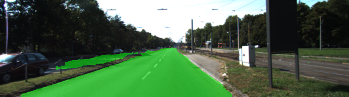
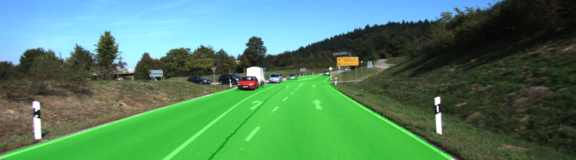
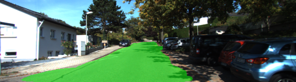

# Semantic Segmentation Fully Convolutional Neural Network
Semantic Segmentation - It label the pixels of a road in images using a Fully Convolutional Network (FCN).

# Index
- [Prerequisites](#Prerequisites)
- [Neural network archtecture](#Neural-network-archtecture)
- [Some results](#Some-results)
- [Setup](#Setup)
    - [Frameworks and Packages](#Frameworks-and-Packages)
    - [Dataset](#Dataset)
    - [Add a custom Dataset](#Add-a-custom-Dataset)
- [Facens Model](#Facens-Model)
- [Start](#Start)
    - [Usage](#Usage)
    - [google colabotory - GPU 4free](#Running-at-google-colabotory---GPU-4free)

## Prerequisites
```
    pip install opencv-python opencv-contrib-python scipy==1.2.0 Pillow matplotlib tensorflow-gpu numpy colored
```
## Neural network archtecture
The project start loading a vgg model so implements an FCN - Fully Convolutional Network 


More details about how VGG16 is used in this archtechture to converte it to a fully convolutional network, you can read ['this paper']('https://people.eecs.berkeley.edu/~jonlong/long_shelhamer_fcn.pdf').

## Some results
 

 

 


## Setup
#### Frameworks and Packages
Make sure you have the following is installed:
 - [Python 3](https://www.python.org/)
 - [TensorFlow](https://www.tensorflow.org/)
 - [NumPy](http://www.numpy.org/)
 - [SciPy](https://www.scipy.org/)

#### Dataset
The project will download the [Kitti Road dataset](http://www.cvlibs.net/datasets/kitti/eval_road.php) dataset from [here](http://www.cvlibs.net/download.php?file=data_road.zip). It will extract the files in `data` folder.  This will create the folder `data_road` with all the training a test images.

#### Add a custom Dataset
Add images in data/data_road/training/
##### Example: 
 - gt_image_2/um_lane_000000.png
 - image_2/um_000000.png

##### **Obs: The images in qt_image_2 are not a image with 4 channels (png file), are a jpg.**
.
#### Facens Model
To get Facens dataset for [labmovel project](https://github.com/huberemanuel/labmovel/tree/dev), click [here](https://drive.google.com/file/d/1bfSr2wo3YD6ANtCpeSnru0pxngsiFKGn/view?usp=sharing)


## Start

#### Usage
Run the following command to run the project:
```
python main.py
```
#### Examples to run the project
```
python main.py -e 25 -i './data/data_road/training/image_2/*.png' -l './data/data_road/training/gt_image_2/*_road_*.png' -n 2
python main.py -m model/model.ckpt --pred_data_from zed --disable_gpu
python main.py -m model/model.ckpt -V teste.png --pred_data_from image
python main.py -m model/model.ckpt -V teste.mp4 --pred_data_from video
```

it will run the Neural network with default parameter values, to know more, type `python main.py -h`

```
Usage: main.py [options]

Options:
    -h, --help            show this help message and exit
    -i GLOB_TRAINIG_IMAGES_PATH, --glob_trainig_images_path=GLOB_TRAINIG_IMAGES_PATH
                        Path where is yours images to train the model. eg:
                        ./data/data_road/training/image_2/*.png'
    -l GLOB_LABELS_TRAINIG_IMAGE_PATH, --glob_labels_trainig_image_path=GLOB_LABELS_TRAINIG_IMAGE_PATH
                        Path where is yours label images to train the model.
                        eg: ./data/data_road/training/gt_image_2/*_road_*.png
    -r LEARN_RATE, --learn_rate=LEARN_RATE
                        The model learn rate | Default=9e-5
    -n NUM_CLASSES, --num_classes=NUM_CLASSES
                        Number of classes in your dataset | Default value = 2
    -e EPOCHS, --epochs=EPOCHS
                        Number of epochs that FCN will train | Default=25
    -b BATCH_SIZE, --batch_size=BATCH_SIZE
                        Number of batch size for each epoch. | Default=4
    -t DATA_PATH, --data_path=DATA_PATH
                        Training data path. | Default='data_road/training'
    -p LOG_PATH, --log_path=LOG_PATH
                        Path to save the tensorflow logs to TensorBoard |
                        Default='.'
    -v VGG_DIR, --vgg_dir=VGG_DIR
                        Path to dowloand vgg pre trained weigths. |
                        Default='./data/vgg'
    -g GRAPH_VISUALIZE, --graph_visualize=GRAPH_VISUALIZE
                        create a graph image of the FCN archtecture. |
                        Default=False
    -m path_data, --path_model
                        Load a model, to predict a data. | 
                        Default=False
    -V PATH_DATA, --path_data", Path to predict a data. | 
                        Default= ''
    --pred_data_from PRED_DATA_FROM, Choose a type predict [video, image, zed] | 
                        Default=video
    --disable_gpu DISABLE_GPU, Disable predict by GPU
```

#### Running at google colabotory - GPU 4free
Open this [link](https://colab.research.google.com/drive/1bwYKqgZIKlMRuTqD0HdU3DeHJzH9xwe4)
